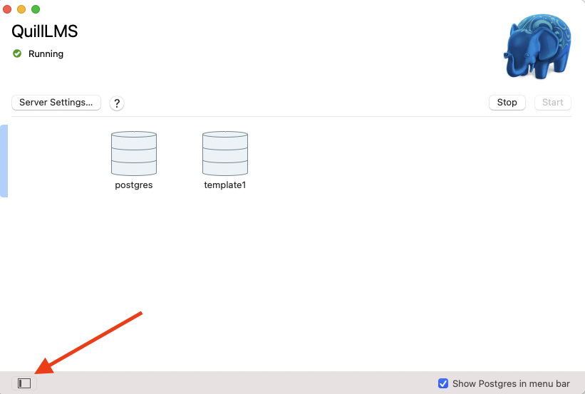
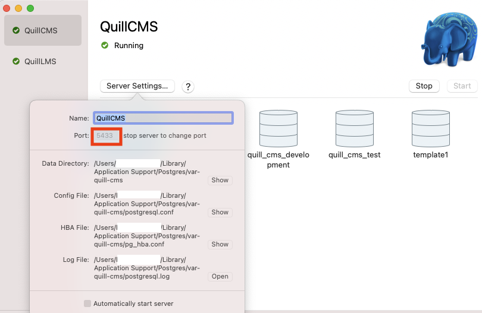

# README


## Installation / Setup
1.  clone the repo
1. `brew install elasticsearch@6`
1. `gem install bundler`
1. `bundle install`
1. Choose one:
   * Docker: `docker-compose up`
   * Postgres.app:
     1. ```echo "DEV_POSTGRES_USER=`whoami` \nDEV_POSTGRES_PASSWORD= " >> .env ``` 
     1. Add profile
     1. Set port to 5433
   
1. `rake db:create`
1. `rake db:migrate`
1. `rake 'responses_csv:import['your/path/to/sample-responses.csv']'`
1. `brew services start elasticsearch@6`
1. `rails c`
1. `Response.__elasticsearch__.create_index!`
1. `Response.__elasticsearch__.import`
1. Start redis server: ```redis-server --port 6400```
1. `rails s`
1. Go to: [localhost:3100](http://localhost:3100)

## Test Suite
```ruby
bundle exec rspec spec
```

## Deployment
Prerequisites:

1. Ensure the elastic beanstalk CLI is [installed and configured](https://docs.aws.amazon.com/elasticbeanstalk/latest/dg/eb-cli3-install.html) 
1. `QuillCMS$ eb init --interactive`
	- default region -> `us-east-1 : US East (N. Virginia)`
	- application -> `QuillCMS`
	- default environment -> `Quillcms-production`
	- platform -> `Puma with Ruby 2.6 on 64bit Amazon Linux`
1. `QuillCMS$ git checkout production && git pull`
1. `QuillCMS$ bash deploy.sh staging|prod` 

## Infrastructure
TODO