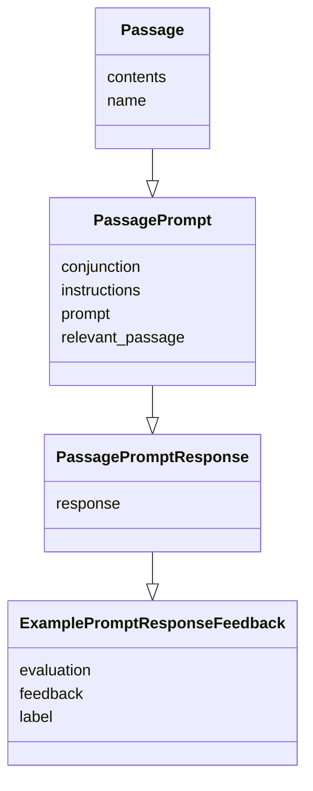
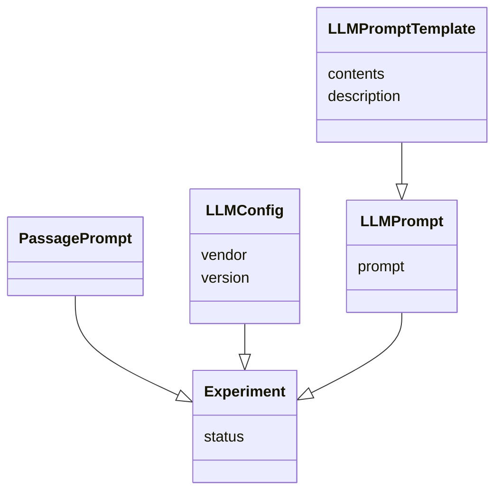
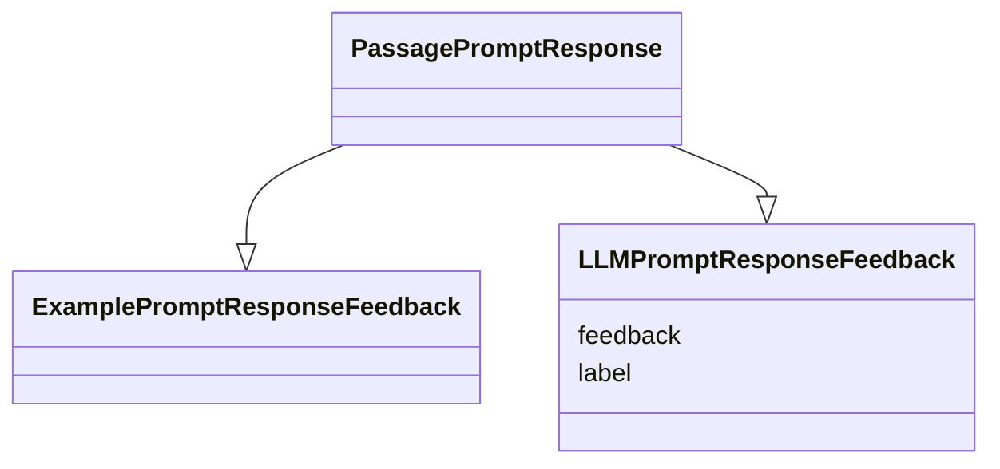

# Generative AI Experiments
## 1. Data Importing
`Passage`, `PassagePrompt`, `PassagePromptResponse` and `ExamplePromptResponseFeedback` records are imported with the following structure

## 2. Experiment Configuration
Within the create `Experiment` UI, `LLMConfig`, `LLMPromptTemplate0` and `PassagePrompt` are all selected. Before creation, substitutions are made to the `LLMPromptTemplate` contents and yielding an `LLMPrompt` record which is associated with the experiment

## 3. Experiment Ouptut
As the `Experiment` is run, the LLM returns feedback relevant to the `PassagePromptResponse` which is stored as `LLMPromptResponseFeedback`.   These results are compared with ExamplePromptResponseFeedback and evaluated.

