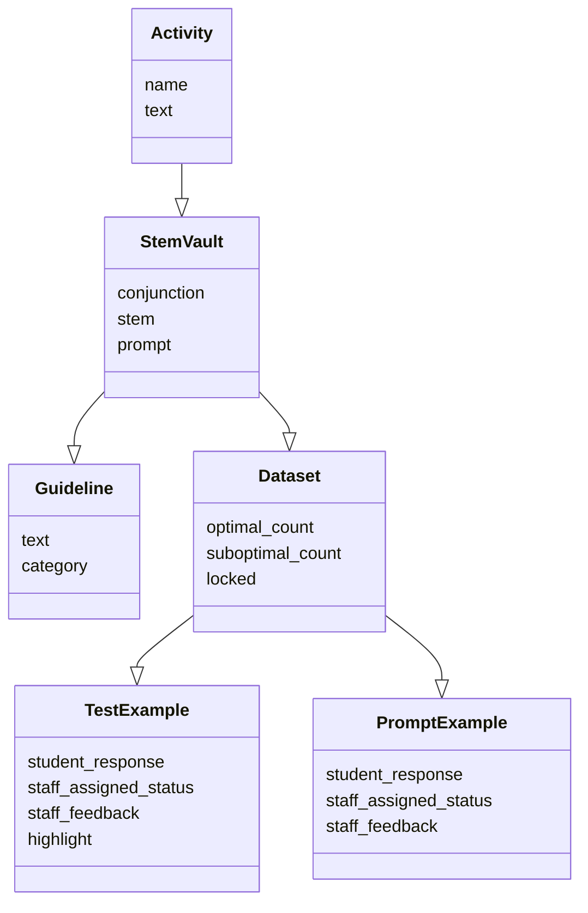
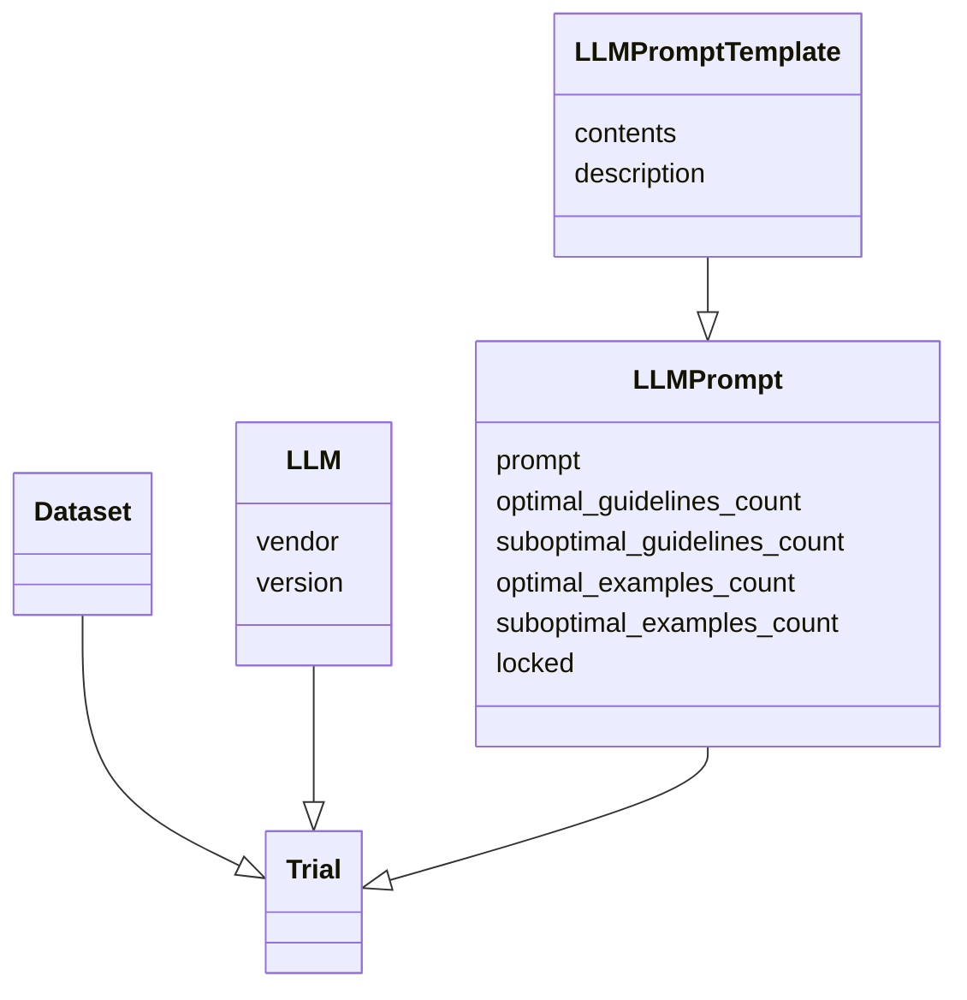
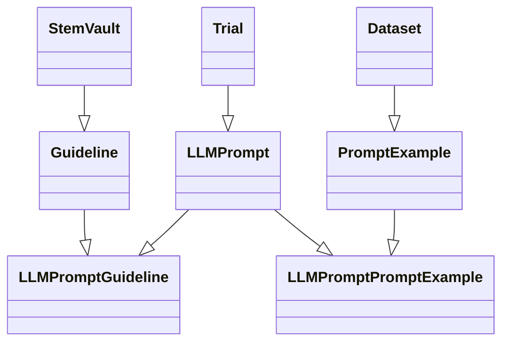
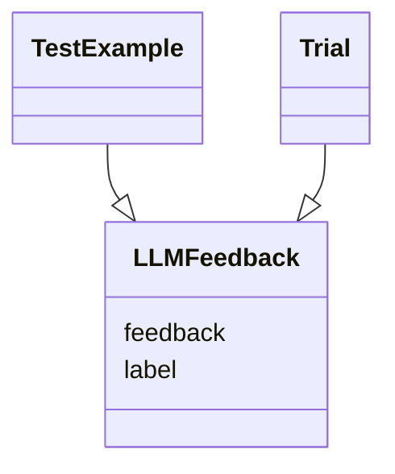

# Generative AI Trials
## 1. Data Importing
`Activity`, `StemVault`, `Dataset`, `TestExample`, and `PromptExample` records are imported with the following structure

## 2. Trial Configuration

Within the create `Trial` UI, `LLM`, `LLMPromptTemplate` are selected. Before creation, substitutions are made to the `LLMPromptTemplate` contents and yielding an `LLMPrompt` record which is associated with the trial.

## 3. LLMPrompt Configuration

Within the UI, the user can select `PromptExample` and `Guideline` records for the `LLMPrompt` which will create `LLMPromptPromptExample` and `LLMPromptGuideline` records respectively.

## 4. Trial Ouptut

As the `Trial` is run, the LLM returns feedback relevant to each `TestExample` which is stored as `LLMFeedback` along with the corresponding `trial_id`.   These results are compared with `QuillFeedback` and evaluated.

