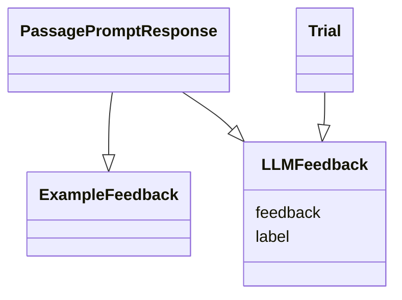

# Generative AI Trials
## 1. Data Importing
`Passage`, `PassagePrompt`, `PassagePromptResponse` and `ExampleFeedback` records are imported with the following structure

## 2. Trial Configuration
Within the create `Trial` UI, `LLM`, `LLMPromptTemplate0` and `PassagePrompt` are all selected. Before creation, substitutions are made to the `LLMPromptTemplate` contents and yielding an `LLMPrompt` record which is associated with the trial

## 3. Trial Ouptut
As the `Trial` is run, the LLM returns feedback relevant to the `PassagePromptResponse` which is stored as `LLMFeedback` along with the corresponding `trial_id`.   These results are compared with `ExampleFeedback` and evaluated.

